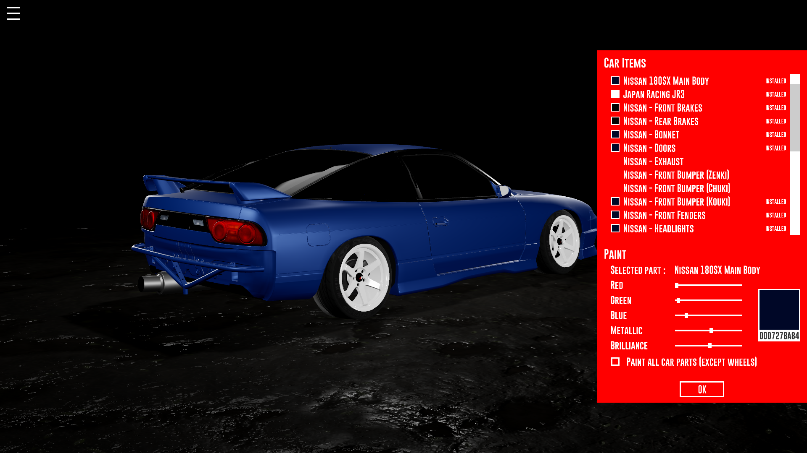

<p align="center">
  
  
  
  
</p>

<p align="center">
  
</p>


Project Naer
============

Have you always wondered how your car will look in this color?
Or with these wheels? Or with this body kit?
Or maybe you spend more time in Need For Speed customizing your car than
playing the actual game? I have something for you!

Project Naer is a simple application which allows to personalize your car.
Here are the elements you can change to customize your car:
- wheels : rim and tyre, color, diameter, width, camber, offset and toe
- car : color, body kits and every individual part composing its body

You can also change the ground on which the car is sitting
among 10 possibilities.

Project Naer is scalable. This means new content can be added without
having to change a single line of code: the new content will be detected
automatically and added to the corresponding menu.


Screenshots
===========





Content
=======

Available cars:
- Nissan 180SX (RS13) : 9 different bodykits
- _more soon ..._

Available wheels:
- BBS LM
- Japan Racing JR3
- Japan Racing JR7
- _more soon ..._

Available grounds:
- Asphalt
- Cobblestones
- Concrete Tiles
- Concrete (wet)
- Frozen Lake
- Linoleum
- Marble
- Mosaic
- Mud
- Sand

Keep in mind that new content will be added bit by bit during the development.


Shortcuts
=========

Some actions can be triggered, or menus displayed, using the following shortcuts : 

- `A` to toggle ON/OFF the autorotation of the camera around the car
- `B` to display the body shop menu 
- `G` to display the garage menu
- `I` to save the image to the screenshot folder

When the autorotation is OFF, holding ``LMB`` allows you to 
manually rotate the camera around the car.

These shortcuts are customizable by editing `config/config.json` and searching
for `shortcuts`.


Configuration
=============

The default resolution is `1920 x 1080`.

If you want to change it, edit the file `config/release.prc`
and search for the parameter named `win-size`.


Dependencies
============

The following Python modules need to be installed:

```bash
pip install typing-extensions
pip install panda3d==1.10.13.post1
pip install panda3d-gltf==1.1.0
pip install panda3d-simplepbr==0.11.2
````

The above versions are the recommended ones.

If you experience any error or glitch, it is recommended to switch to the above versions.  


License
=======

This project is licensed under a [Creative Commons Attribution-NonCommercial-ShareAlike 4.0 International License](http://creativecommons.org/licenses/by-nc-sa/4.0/).
